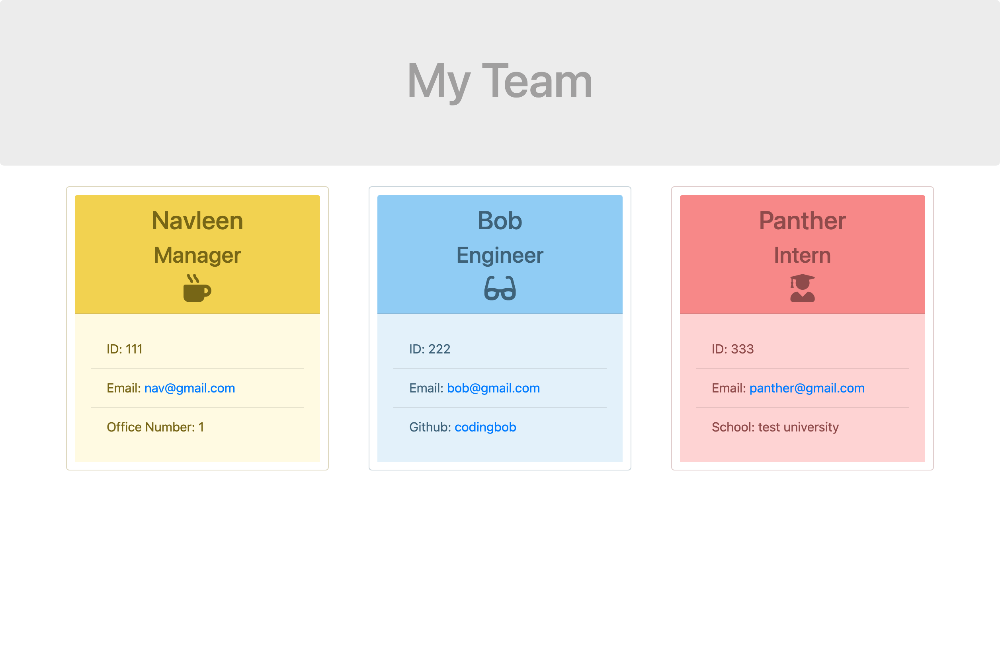
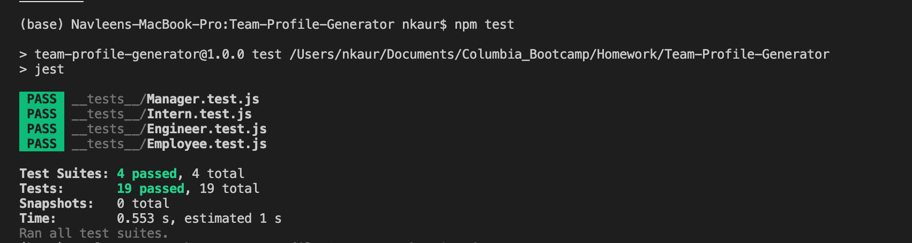
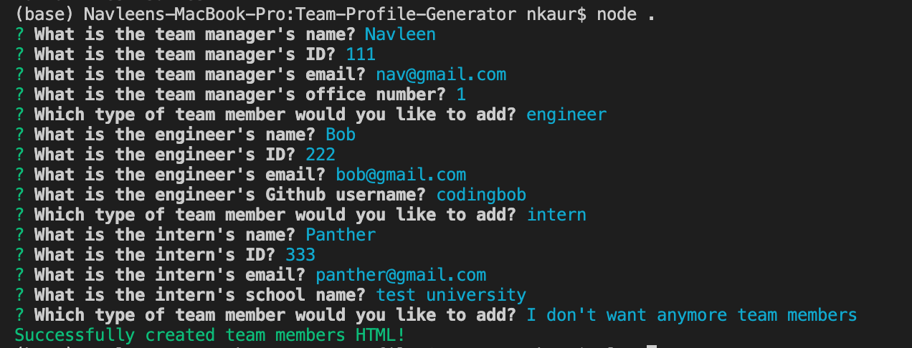
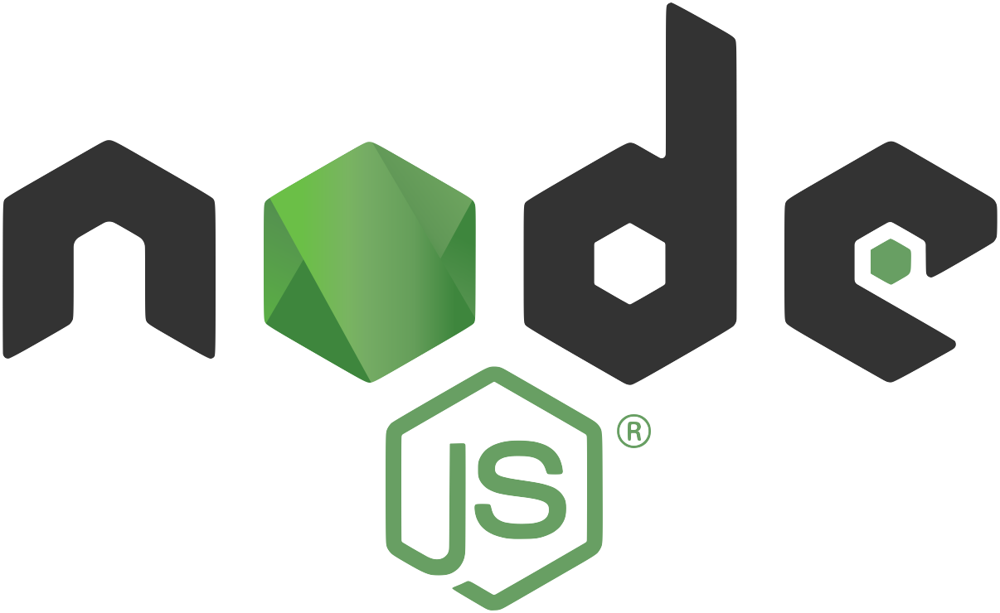

# Team-Profile-Generator
## Table of Contents
* <a href="#about">About</a>
* <a href="#preview">Preview</a>
* <a href="#installation">Installation</a>
* <a href="#unit-testing">Unit Testing</a>
* <a href="#usage">Usage</a>
* <a href="#technologies">Technologies</a>

## About 
<i><b>Team Profile Generator</b></i> is a Node.js command-line application that takes in information about employees on a software engineering team, then generates an HTML webpage that displays summaries for each person. Testing is key to making code maintainable, so I wrote a unit test for every part of the code and ensured that it passed each test.


## Preview


https://user-images.githubusercontent.com/58195156/131735740-059b0ba2-3128-41b8-96fd-d1abfaa71304.mov

## Installation
* Clone the GitHub repository onto your desktop
* Open up the "Team-Profile-Generator" file in a command terminal.
* Use "npm install" to install all required dependencies for the app.
```
npm install
```

## Unit Testing
* Use "npm test" to test the application to make sure it works properly.
```
npm test
```
* If all the tests pass, the terminal will show the following:


## Usage
* Use "node index.js" to run the application. Answer the questions as asked and the HTML will be generated.
```
node index.js
```
* The following is an example of the CLI being ran:


## Technologies
&nbsp; &nbsp;
&nbsp; &nbsp; &nbsp; 
&nbsp; &nbsp; &nbsp; 



